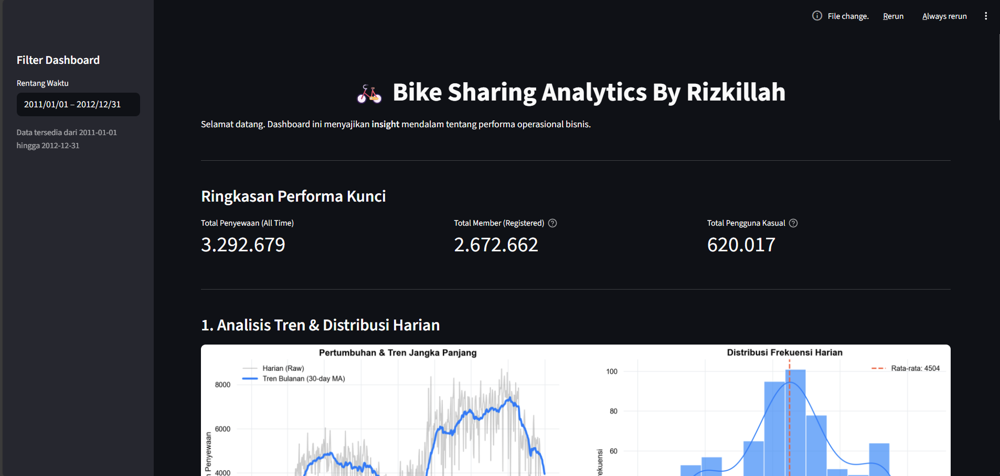

# 🚲 Bike Sharing Data Analysis

<p align="center">
  
  
  
</p>

**Proyek Analisis Data: Bike Sharing Dataset**

Repository ini berisi proyek data analytics yang merupakan bagian dari submission "Belajar Analisis Data dengan Python" di Dicoding. Proyek ini berfokus pada analisis data penyewaan sepeda untuk mendapatkan wawasan bisnis yang berguna.

## 📊 Preview Dashboard
Berikut adalah tampilan dashboard interaktif yang dibuat menggunakan Streamlit:


*(Pastikan file dashboard.png sudah ada di root folder repository)*

🔗 **Live Demo:** [Klik di sini untuk melihat Dashboard](https://bike-sharing-analytics-by-rizkillah.streamlit.app/)

## 📝 Deskripsi Proyek
Proyek ini bertujuan untuk menganalisis data penyewaan sepeda (Bike Sharing Dataset). Analisis ini berfokus pada identifikasi pola musiman, pengaruh cuaca terhadap jumlah penyewaan, serta perbandingan antara pengguna kasual dan terdaftar.

**Pertanyaan Bisnis yang Dijawab:**
* Berapa rata-rata, minimum, dan maksimum jumlah peminjaman sepeda per hari ? <br>
* Apakah kelembaban (hum) dan kecepatan angin (windspeed) mempengaruhi jumlah peminjaman ? <br>
* Bagaimana perbedaan jumlah penyewaan antara: Hari kerja vs hari libur? <br>
* Bagaimana perbedaan jumlah penyewaan antara: Musim panas vs musim dingin? <br>
* Pada jam berapa penyewaan sepeda paling tinggi ? <br>

## 📂 Struktur Direktori
Berikut adalah struktur folder dari proyek ini:

```text
.
├── dashboard
│   ├── dashboard.py      # File utama untuk menjalankan dashboard Streamlit
│   └── main_data.csv     # Dataset bersih yang digunakan untuk dashboard
├── data
│   ├── day.csv           # Dataset harian (mentah)
│   └── hour.csv          # Dataset per jam (mentah)
├── notebook.ipynb        # Jupyter Notebook untuk eksplorasi dan analisis data
├── README.md             # Dokumentasi proyek
└── requirements.txt      # Daftar pustaka Python yang dibutuhkan
```

## ⚙️ Instalasi

1. **Clone Repository**

   ```shell
   git clone https://github.com/Diki04/Analisis-Data.git
   cd Analisis-Data
   ```

2. **Setup Environment (Opsional tapi Disarankan)**
   Sangat disarankan untuk menggunakan environment virtual agar tidak mengganggu instalasi Python global.

   ```shell
   # Untuk Windows
   python -m venv venv
   venv\Scripts\activate

   # Untuk Mac/Linux
   python3 -m venv venv
   source venv/bin/activate
   ```

3. **Install Dependencies**
   Pastikan Anda berada di dalam direktori proyek, lalu jalankan:

   ```shell
   pip install -r requirements.txt
   ```

4. **Jalankan Dashboard**
   Masuk ke direktori dashboard dan jalankan aplikasi Streamlit:

   ```shell
   cd dashboard
   streamlit run dashboard.py
   ```

## 📚 Teknologi yang Digunakan
- **Python**: Bahasa pemrograman utama.
- **Pandas**: Untuk manipulasi dan analisis data.
- **NumPy**: Untuk operasi numerik.
- **Matplotlib & Seaborn**: Untuk visualisasi data statis.
- **Streamlit**: Untuk membuat dashboard interaktif berbasis web.

## 🤝 Kontribusi
Kontribusi selalu diterima! Jika Anda ingin berkontribusi:
1. Fork repository ini.
2. Buat branch fitur baru (`git checkout -b fitur-baru`).
3. Commit perubahan Anda (`git commit -m 'Menambahkan fitur baru'`).
4. Push ke branch tersebut (`git push origin fitur-baru`).
5. Buat Pull Request.

---
**© Created by Rizkillah Ramanda Sinyo - 2026**